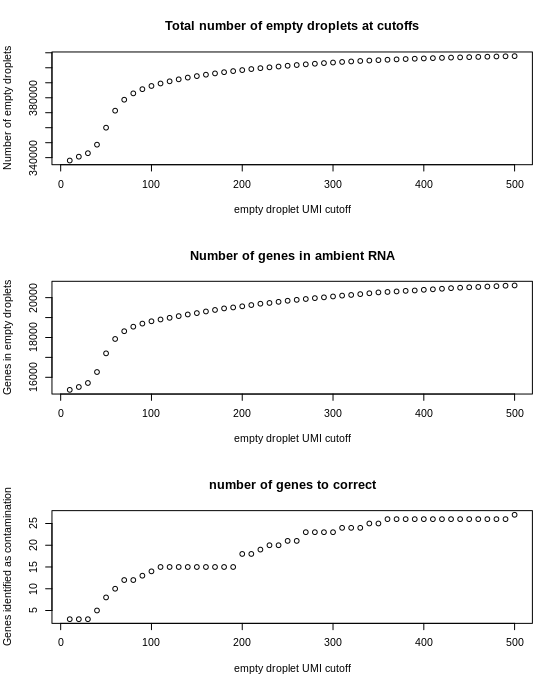

# FastCAR

FastCAR is an R package to remove ambient RNA from cells in droplet based single cell RNA sequencing data.

## Getting Started

These instructions will get you a copy of the project up and running on your local machine for development and testing purposes. See deployment for notes on how to deploy the project on a live system.

### Prerequisites

What things you need to install the software and how to install them

```
Give examples
```

### Installing

FastCAR can be install from git with the following command.

```
devtools::install_git("https://git.web.rug.nl/P278949/FastCAR")
```

Running FastCAR is quite simple.
First load the library and dependencies.

```
library(Matrix)
library(Seurat)
library(qlcMatrix)
library(FastCAR)
```
Specify the locations of the expression matrices

```
cellExpressionFolder  = c("Cellranger_output/sample1/filtered_feature_bc_matrix/")
fullMatrixFolder      = c("Cellranger_output/sample1/raw_feature_bc_matrix/")
```
Set a location for storing the corrected cell/gene matrix

```
correctedMatrixFolder = c("Cellranger_output/sample1/corrected_feature_bc_matrix")
```
Load both the cell matrix and the full matrix
```
cellMatrix     = read.cell.matrix(cellExpressionFolder)
fullMatrix     = read.full.matrix(fullMatrixFolder)
```
The following functions give an idea of the effect that different settings have on the ambient RNA profile. 
These are optional as they do take a few minutes and the default settings work fine
Plotting the number of empty droplets, the number of genes identified in the ambient RNA, and the number of genes that will be corrected for at different UMI cutoffs,

```
ambProfile = describe.ambient.RNA.sequence(fullCellMatrix = fullMatrix, 
                                           start = 10, 
                                           stop = 500, 
                                           by = 10, 
                                           contaminationChanceCutoff = 0.05)
                                           
plot.ambient.profile(ambProfile)
``` 



Set the empty droplet cutoff and the contamination chance cutoff

The empty droplet cutoff is the number of UMIs a droplet can contain at the most to be considered empty.
100 works fine but we tested this method in only one tissue. For other tissues this might not be the.
Increasing this number also increases the highest possible value of expression of a given gene.
As the correction will remove this value from every cell it is adviced not to set this too high and thereby overcorrect the expression in lowly expressing cells.

The contamination chance cutoff is the allowed probability of a gene contaminating a cell. 
As we developed FastCAR specifically for differential expression analyses between groups we suggest setting this such that not enough cells could be contaminated to affect this.
In a cluster of a thousand cells divided into two groups there would be 2-3 cells per group with ambient RNA contamination of any given gene.
Such low cell numbers are disregarded for differential expression analyses.

```
emptyDropletCutoff        = 100 
contaminationChanceCutoff = 0.05
```

Determine the ambient RNA profile and remove the ambient RNA from each cell
```
ambientProfile = determine.background.to.remove(fullMatrix, cellMatrix, emptyDropletCutoff, contaminationChanceCutoff)
cellMatrix     = remove.background(cellMatrix, ambientProfile)
```

Finally write the corrected cell/gene matrix to a file, this matrix can be used in Seurat the same way as any other cell/gene matrix.

```

write.corrected.matrix(cellMatrix, correctedMatrixFolder, ambientProfile)

```


## Authors

* **Marijn Berg** - m.berg@umcg.nl

## License

This project is licensed under the GPL-3 License - see the [LICENSE.md](LICENSE.md) file for details

